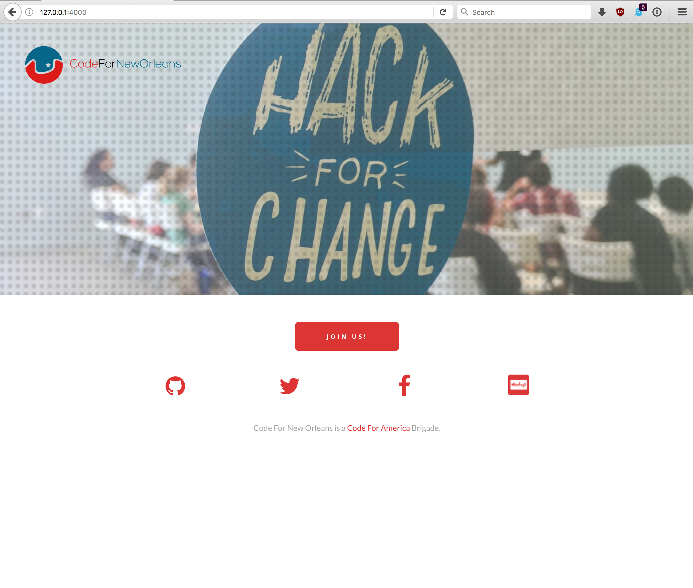

# Code For New Orleans (Static Site)

This repo is a [Jekyll](https://jekyllrb.com/) project for the Code for New Orleans
static site to be hosted at [http://codeforneworleans.org/](http://codeforneworleans.org/).
It's just a single page right now and it copies over the site made by Ken
done in Wordpress. We haven't added a blog or chosen any themes.

Everything from the wordpress site is prefixed with `old_wordpress` and the layout is called `old_wordpress.html` to allow
easy transitioning into something custom.



## Running Locally

You'll first need an up to date ruby and rubygems. Some systems (like OS X) come with ruby installed already.
If you don't have ruby, you can read [ruby installation instructions here](https://www.ruby-lang.org/en/documentation/installation/).

**A note to linux users: The stable ruby packages are often out of date. You may experience problems with a ruby
below version 2.0.0. You may want to use an alternative respository with an up to date ruby.**

To install the jekyll binary run:

```
gem install jekyll
```

This may require sudo privileges. After this, you should be able to cd to this directory and run:

```
jekyll serve
```

This will run a webserver on your localhost at port `4000`. Point your browser to [http://127.0.0.1:4000/](http://127.0.0.1:4000) to see the site.

If you want changes to compile automatically, pass the `--watch` option:

```
jekyll serve --watch
```

For further learning on jekyll, [see their documentation](https://jekyllrb.com/docs/home/).

## Contributing

See the [Contributing Guildlines](CONTRIBUTING.md).
